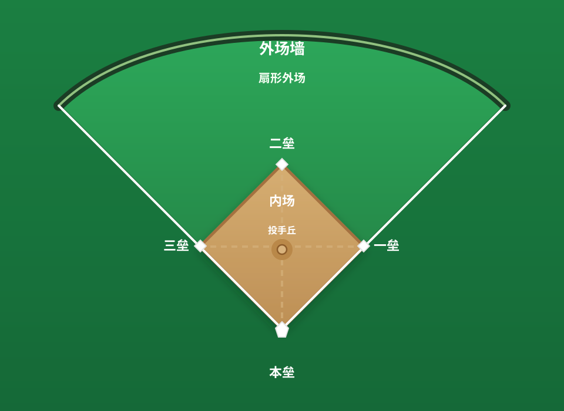
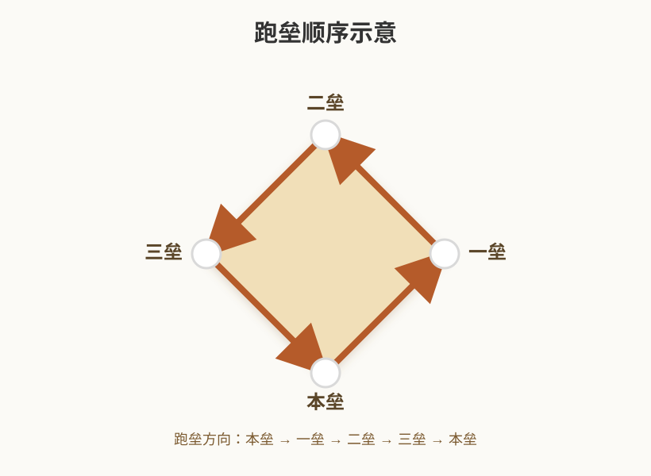

# 棒球详细规则

## 1. 比赛的基本目标

棒球可以先记成一句话：**把球打出去，跑回来得分；把对方拦住，不让他们得分。**

- **进攻方**：负责击球和跑垒，目标是把队员送回本垒。
- **防守方**：负责投球、接球、传球和制造出局。
- 比赛结束时，**得分更多的一方获胜**。

### 1.1 一局的最简单流程

```text
投手投球 → 击球员决定挥棒/看球 → 球进场内就开始跑垒
            ↓
        防守方接球传球
            ↓
      3 个出局后交换攻守
```

## 2. 场地与器材

### 2.1 场地基本结构

你可以先把球场想成一个大菱形：四个垒包围成内场，外面是外野。



- **本垒**：打击开始点，也是跑垒得分的终点。
- **一垒、二垒、三垒**：跑垒员依次需要经过的三个垒包。
- **内场（Infield）**：四个垒包围成的区域。
- **外场（Outfield）**：内场之外的区域。
- **投手丘**：投手站立并投球的位置。
- **界内区（Fair Territory）**：有效比赛区域。
- **界外区（Foul Territory）**：出界区域，界外球通常不算有效打击结果。

### 2.2 常见器材

- **棒球**：比赛用球。
- **球棒**：击球员使用的器材；不同联赛对材质、长度、直径、是否可改装有不同限制。
- **手套**：野手接球用；捕手手套和一垒手手套有特殊规格。
- **头盔**：击球员和跑垒员通常必须佩戴。
- **护具**：捕手会使用面罩、胸甲、护腿等防护装备。

## 3. 球队、阵容与位置

### 3.1 防守阵容

防守方通常有 9 名球员。

你可以先这样记：**投手和捕手在中间，四个内野手围着垒包，三个外野手守在后方。**

1. 投手
2. 捕手
3. 一垒手
4. 二垒手
5. 三垒手
6. 游击手
7. 左外野手
8. 中外野手
9. 右外野手

### 3.2 打击顺序

- 每支球队在赛前提交**打击顺序**，顺序固定。
- 打击顺序一旦确定，原则上不能随意跳号。
- 如果出现**打顺错误**，通常属于可申诉事项，裁判会按规则裁定。

### 3.3 替补与换人

常见的替补方式包括：

- **代打**：用新的击球员替换当前打席球员。
- **代跑**：用新的跑垒员替换垒上的球员。
- **守备替换**：用新的守备球员替换场上防守者。
- **换投**：用新的投手替换当前投手。

补充说明：

- 在许多职业规则中，球员被换下后通常**不能再回到场上**。
- **指定打击（DH）**是否启用，要看联赛规定；有的联赛允许投手不打击，由指定打击代替。

## 4. 比赛如何进行

### 4.1 局数与半局

- 一场标准比赛通常是 **9 局**。
- 每局分为**上半局**和**下半局**。
- 上半局由客队进攻、主队防守；下半局交换。
- 每个半局在出现 **3 个出局** 后结束。

### 4.2 比赛结束条件

比赛在以下情况结束：

- 规定局数打完，比分一方领先。
- 主队在最后需要进行的下半局结束前已经取得领先，比赛立即结束。
- 平局时进入**延长赛**，直到分出胜负。
- 某些联赛可能有**提前结束规则**（例如大比分差距、天气中断、时间限制等）。

### 4.3 延长赛

- 标准规则下，九局打平会进入延长赛。
- 延长赛的局数没有固定上限，直到分出胜负。
- 不同联赛对延长赛可能有不同附加规定，例如额外起始跑垒员等。

## 5. 投球规则

### 5.1 投球的基本状态

投手在投球时，必须按照规则从投手丘进行合法投球，使用上手投球，动作必须连贯，球在合手后要停留一秒再出手。

### 5.2 好球与坏球

裁判会看投球有没有经过好球带。简单说：**球投得太偏，叫坏球；球投得合适，叫好球。**

- **好球**：
  - 球经过好球带；
  - 击球员挥棒落空；
  - 击球员打成界外球（通常在两好球前会记好球，但有些特殊情况例外）；
  - 某些触击界外的情况也会继续记作好球。
- **坏球**：
  - 球没有经过好球带，且击球员没有挥棒。

### 5.3 好球带

你可以把好球带理解成一个站在本垒前方、**从膝盖上方到肩膀中间**的大长方体区域。球如果从这个区域穿过去，通常就算好球。

具体判定以裁判判断为准。

### 5.4 三振与保送

- **三振**：击球员累计 3 个好球出局。
- **保送**：投手累计 4 个坏球，击球员自动上一垒。
- **满球数**：3 好球、2 坏球。

### 5.5 投手犯规与非法投球

投手必须按规则动作投球，常见违规包括：

- 没有按要求在投手板上完成合法姿势；
- 在固定式中没有做出完整停顿；
- 假动作或牵制动作不合法；
- 快投或其他欺骗性非法动作；
- 某些情况下从投手板上做出违规动作。

这类判罚通常称为 **balk（投手犯规）** 或 **illegal pitch（非法投球）**，具体处罚要看是否有跑垒员、联赛规则和裁判判定。

### 5.6 牵制与拾垒

- 投手可以向垒包做**牵制**，试图抓到离垒过远的跑垒员，不能将球传给没有跑垒员的垒上。
- 牵制动作也受严格限制，不能用假投、假传骗取不合法优势。
- 跑垒员被牵制出局，记为**触杀出局**或**封杀出局**，取决于是否被迫进垒。

## 6. 打击规则

### 6.1 击球员站位

击球员轮到自己打席时，站进打击区，等投球过来再决定是挥棒、看球，还是做触击。

### 6.2 打席结果的主要类型

一个打席最后通常会变成下面几种结果：

- **安打**：把球打进场内，而且自己安全上垒。
- **出局**：被三振、接杀、封杀、触杀或其他规则判定出局。
- **保送**：投手投坏 4 球，直接上一垒。
- **触身球**：被球打到身体，通常可上一垒。
- **失误上垒**：因为防守失误而安全上垒。

### 6.3 安打与打击结果

- **一垒安打**：击球员安全上一垒。
- **二垒安打**：击球员安全到二垒。
- **三垒安打**：击球员安全到三垒。
- **本垒打 / 全垒打**：球合法飞出界外或按规则形成全垒打，击球员和垒上跑者依次得分。
- **内野安打**：球虽然没有离开内场，但击球员凭速度安全上垒。

### 6.4 界内球与界外球

- **界内球（Fair Ball）**：球落在界内并仍处于有效比赛状态。
- **界外球（Foul Ball）**：球落在界外。

通常：

- 界外球会让这一次击球无效或记作好球（两好球前常见）。
- **两好球后**，一般界外球不会直接造成三振，除非是特殊的触击界外或其他特殊规则情形。

### 6.5 接杀、飞球和滚地球

- **飞球被直接接住**：击球员出局。
- **滚地球**：球落地后滚动，守备方可能选择封杀或触杀。
- **高飞球**：外野或内野上空的高弹道球，常见于长打和接杀判定。

### 6.6 触击与短打

- **触击（Bunt）**：击球员不完整挥棒，而是轻轻把球碰出去。
- 常用于推进跑者或制造内野压力。
- 某些触击球若两好球后碰成界外，可能直接记为三振。

### 6.7 被球击中

- 击球员若被投球击中，且符合规则条件，通常会被判上到一垒。
- 如果球碰到击球员时其实已经在好球带内，可能直接按**好球**或**三振**处理。
- 如果击球员主动把身体伸向球，裁判也可能不判触身球。

### 6.8 三振后仍可跑的一种情况

这是很容易混淆的规则：

- 如果击球员在**第三好球未被捕手合法接住**时，满足特定条件，可以继续尝试跑上一垒。
- 若**一垒空着**，或者**两出局**，击球员通常可以尝试跑一垒。
- 若**一垒有人且少于两出局**，击球员一般直接出局。

这就是常说的 **漏接第三好球**。

## 7. 跑垒规则

### 7.1 跑垒的基本顺序

跑垒就是按顺序绕垒：**本垒 → 一垒 → 二垒 → 三垒 → 本垒**。



你可以把它理解成：球员沿着菱形跑一圈，最后回到本垒才算得分。

只有安全踩回本垒，才算得 1 分。

### 7.2 占垒与强制进垒

- 跑垒员占据垒包后，可以继续待在原垒上。
- 当后面的跑垒员把垒包占满时，前面的跑垒员可能被迫向前推进，这叫 **强制进垒**。
- 在强制进垒情况下，防守方只要持球踩到目标垒包，就能完成**封杀**。

### 7.3 触杀与封杀

- **触杀**：防守员持球触碰跑垒员身体或手套中的球，跑垒员出局。
- **封杀**：防守员持球踩到跑垒员必须前进的垒包，跑垒员出局。

### 7.4 盗垒

- **盗垒**：跑垒员在投球过程中尝试提前向下一垒推进。
- 盗垒不是违规，只要没有在规则禁止的时机提前离垒或做出其他违规动作。
- 投手、捕手和内野防守会通过牵制和传球阻止盗垒。

### 7.5 触垒、漏垒与补垒

- 跑垒员必须按顺序**触及**每个垒包。
- 如果漏踩垒包，防守方可以在适当时机提出**申诉（Appeal）**。
- 这种申诉属于很重要的规则点，往往要在下一球或下一次有效动作前进行。

### 7.6 超过一垒

- 击球员跑到一垒后，可以顺势冲过一垒再回头。
- 只要是对一垒的正常越垒，一般不会立刻构成出局。
- 但如果过垒后又明显尝试向二垒推进，就会重新进入可被触杀的风险状态。

### 7.7 飞球出局后的回垒规则

- 当击出的高飞球被防守方**直接接杀**时，垒上的跑垒员必须先**回垒触垒**，然后才能尝试推进。
- 这叫 **补垒 / Tag Up**。
- 如果跑垒员在球被接住前就提前离垒，而防守方申诉成功，可能被判出局。

### 7.8 跑垒员之间的顺序

- 跑垒员不能无故超过前面的跑垒员。
- 如果后面的跑者超过前面的跑者，后者可能被判出局。

## 8. 防守与出局方式

### 8.1 最常见的出局方式

1. **三振出局**：累计三个好球。
2. **接杀出局**：球未落地前被直接接住。
3. **封杀出局**：防守员踩到被迫前进的垒包。
4. **触杀出局**：防守员持球触碰跑垒员。
5. **跑者被申诉出局**：漏垒、越垒、打序错误等在申诉后成立。

### 8.2 双杀与三杀

- **双杀（Double Play）**：一次连续守备动作制造两个出局。
- **三杀（Triple Play）**：一次连续守备动作制造三个出局，极其罕见。

### 8.3 内野飞球规则

这是非常重要的一条规则：

- 在**少于两出局**、且**一垒有人和二垒有人**或**满垒**时，
- 如果击出一个**内场守备员在正常努力下可接住的高飞球**，
- 裁判可能直接判 **内野飞球出局**。

这样做的目的，是避免防守方故意不接球制造双杀。

### 8.4 触杀、封杀与强制出局的区别

- **强制出局**：跑者因为后面有队友顶住了垒包，必须向前推进。
- **封杀**：防守方只要踩到目标垒包即可。
- **触杀**：需要持球触碰跑者本人。

### 8.5 申诉出局（Appeal Play）

防守方可以对一些“看不见但违反规则”的情况提出申诉，例如：

- 跑者漏踩垒包；
- 跑者提前离垒；
- 打序错误；
- 某些跑垒顺序问题。

申诉通常要在下一次投球前或比赛继续前按规则进行。

### 8.6 干扰与阻碍

#### 进攻干扰（Interference）

进攻方如果非法妨碍防守方完成守备，可能被判干扰出局。

常见情形包括：

- 击球员妨碍捕手传球或接球；
- 跑垒员妨碍防守方处理球；
- 教练或场外人员影响守备。

#### 防守阻碍（Obstruction）

防守方在**没有持球**的情况下非法阻碍跑垒员前进，可能被判阻碍。

这类判定通常会让跑垒员获得有利的裁定或额外垒包。

### 8.7 一些特殊守备规则

- **守备员必须在合法区域处理球**，但具体站位和覆盖范围由规则和战术决定。
- **野手失误**不等于自动出局或自动得分，它主要影响记分和推进结果。
- **球员碰到球前后的处理顺序**，在界内/界外、接杀/失误之间非常关键。

## 9. 球的生死状态

### 9.1 活球

**活球**表示比赛仍在进行，跑垒员和防守员都可以继续动作。

### 9.2 死球

**死球**表示本次比赛暂停，球不再进行。

常见死球情形：

- 裁判叫暂停；
- 界外球；
- 某些触身球、干扰、阻碍判罚后的处理；
- 球飞出场外；
- 比赛中断、天气暂停或设备问题等。

### 9.3 死球后的垒包判定

当球变成死球时，裁判会根据规则判定跑者能否获得额外垒包，例如：

- **四坏球**：击球员上一垒；
- **触身球**：击球员上一垒；
- **界内球出界**：可能按规则自动推进两个垒包或其他垒包数；
- **阻碍**：跑垒员可能获得有利裁定；
- **观众干扰**：可能按裁判判断给出垒包。

## 10. 得分规则

### 10.1 何时算分

跑垒员在合法情况下依次踩过所有垒包，并安全触及本垒后，记 1 分。

### 10.2 哪些情况不算分

常见的不算分情况有：

- 第三出局是**强制出局**；
- 第三出局发生在**击球员尚未到达一垒**之前；
- 跑者在未合法得分前已被判出局；
- 申诉成功导致该分无效。

### 10.3 打点与得分的区别

- **得分（Run）**：球队获得的分数。
- **打点（RBI）**：击球员帮助队友得分的记录。

这两个概念相关，但不是一回事。

## 11. 现代职业棒球常见附加规则

下面这些规则并不是所有棒球都统一适用，但在职业联赛里很常见。

### 11.1 指定打击（DH）

- 允许某名球员专门负责打击，不参加防守。
- 投手可以只负责投球，不必进入打击顺序。
- 是否启用由联赛决定。

### 11.2 投球计时（Pitch Timer）

- 为了加快比赛节奏，部分联赛规定投手和击球员必须在限定时间内完成动作。
- 违反计时规则可能被判坏球、自动出局或其他罚则。

### 11.3 守备布阵限制

- 某些现代职业规则对**内野布阵**有位置限制。
- 例如可能要求内野手在投球时分布在二垒两侧，以减少极端移位。

### 11.4 延长赛附加跑者

- 某些联赛在延长赛会让二垒先放一名跑者，以便加快分出胜负。
- 这不是棒球最原始的标准规则，而是联赛附加规则。

### 11.5 回放挑战

- 职业比赛可能允许教练对某些判决提出视频回放挑战。
- 哪些判罚可挑战、可挑战次数、何时使用，都由联赛规定。

## 12. 最容易混淆的几条规则

### 12.1 界外球不是永远都等于“没事”

- 两好球前，界外球通常算好球。
- 两好球后，多数界外球不会直接三振，但触击界外等特殊情况可能会直接出局。

### 12.2 第三好球不一定立刻结束打席

- 如果捕手没合法接住第三好球，击球员在特定条件下还能继续跑一垒。

### 12.3 接杀后要先回垒

- 跑者不能在飞球没被接住之前就随意提前冲垒。
- 球被接住后，必须先补回原垒再推进。

### 12.4 强制出局和触杀不是一回事

- 被迫进垒时，踩垒包就能出局。
- 没有被迫进垒时，通常需要触碰跑者本人。

### 12.5 进攻干扰和防守阻碍方向相反

- 进攻方妨碍防守，是**干扰**。
- 防守方没持球却妨碍跑垒，是**阻碍**。

## 13. 一口气记住整场比赛的逻辑

你可以把一场棒球比赛简化成这条线：

```text
投手投球
  ↓
击球员决定挥棒、看球或触击
  ↓
球进场内 → 跑垒员推进
  ↓
防守方接球、传球、封杀、触杀
  ↓
每个半局 3 个出局后交换攻守
  ↓
九局打完后，比分高者获胜
```

## 14. 小结

棒球规则看起来很多，但本质上围绕四件事展开：

- **投球是否合法**
- **打击结果如何判定**
- **跑垒员能不能安全推进**
- **防守方怎样制造出局**

如果你先把“好球/坏球、出局、上垒、得分、封杀、触杀、申诉、内野飞球、阻碍/干扰”这几组概念弄明白，基本就能看懂大部分比赛。

## 参考来源

- [MLB Rules](https://www.mlb.com/glossary/rules)
- [MLB Official Information](https://www.mlb.com/official-information)
- [MLB-hosted Official Baseball Rules PDF](https://content.mlb.com/documents/2/2/4/305750224/2019_Official_Baseball_Rules_FINAL_.pdf)
- [FreeSVG Baseball Diagram](https://freesvg.org/baseball-diagram)（公有领域）
- [FreeSVG Vector Illustration of a Baseball Diamond](https://freesvg.org/vector-illustration-of-a-baseball-diamond)（公有领域）
